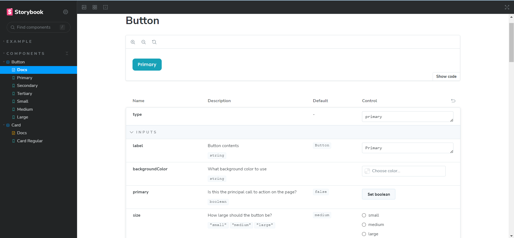
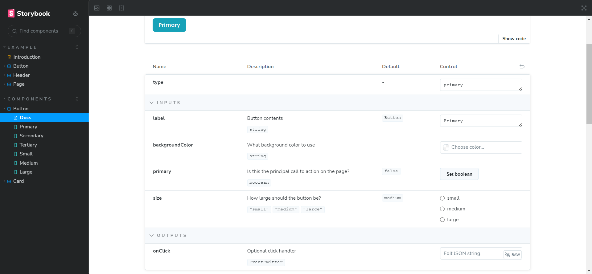
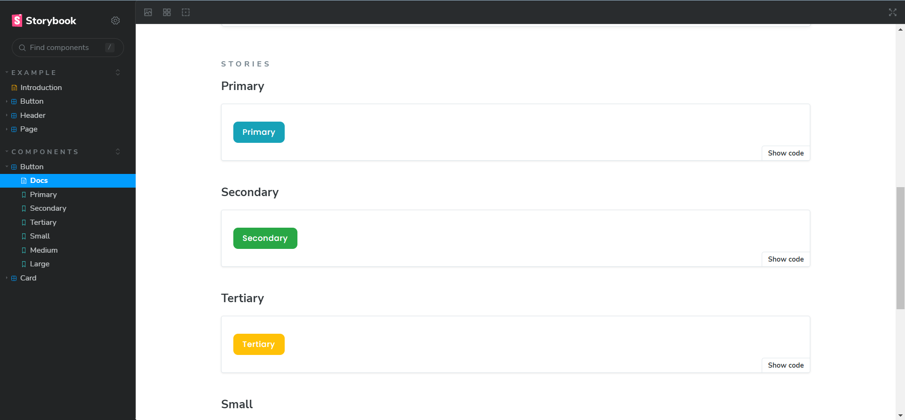
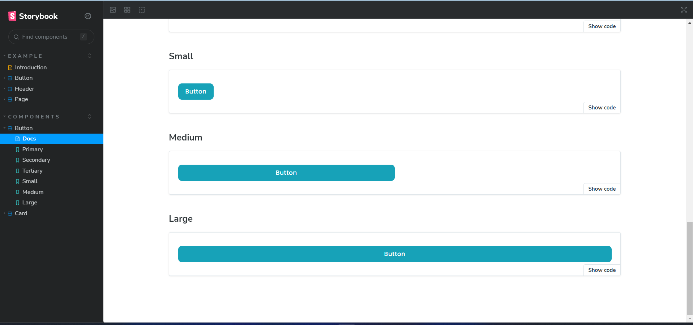
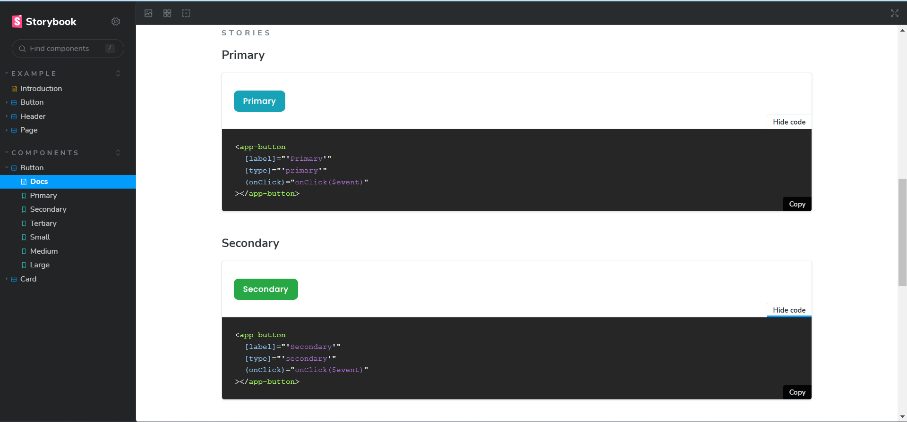
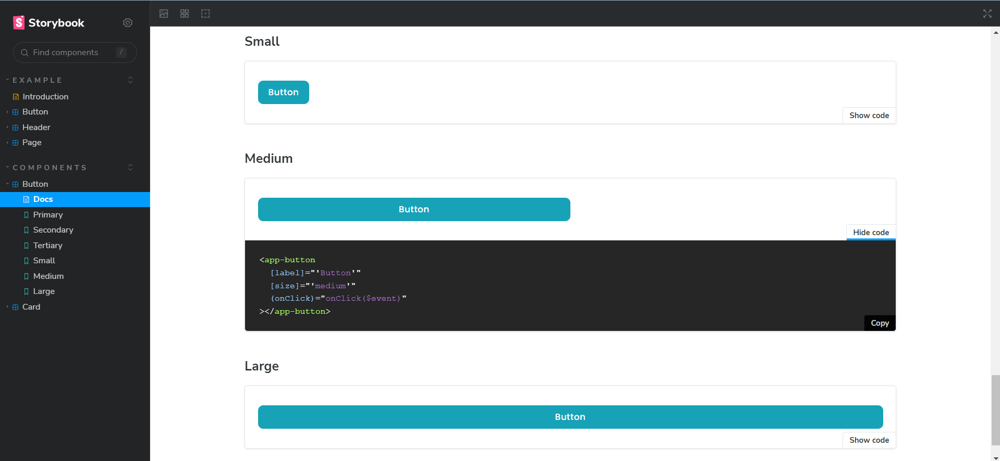
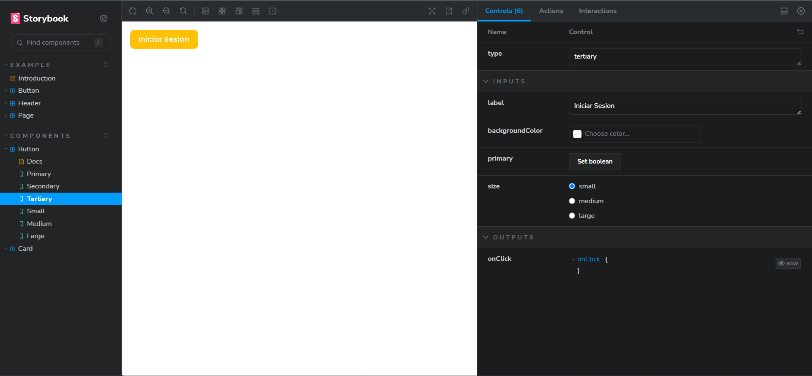
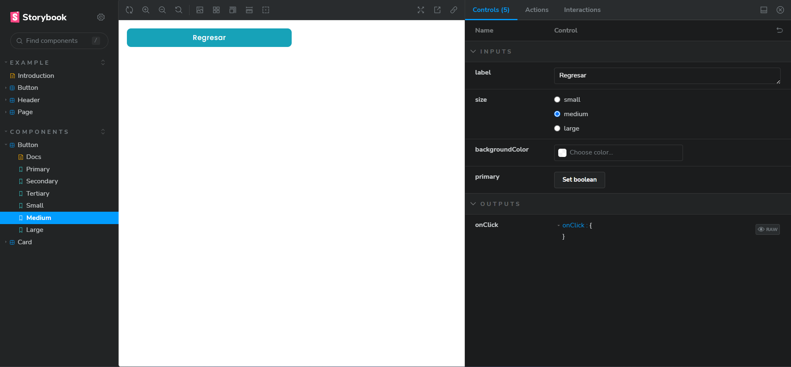
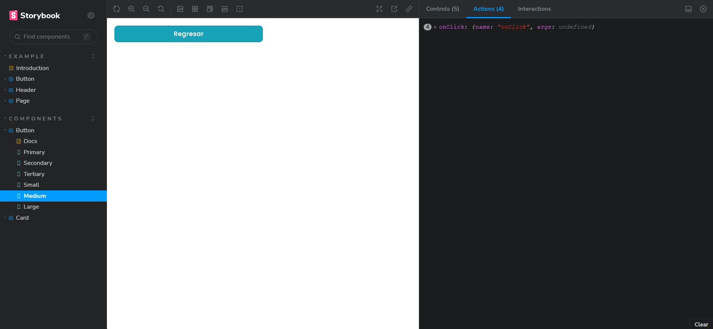
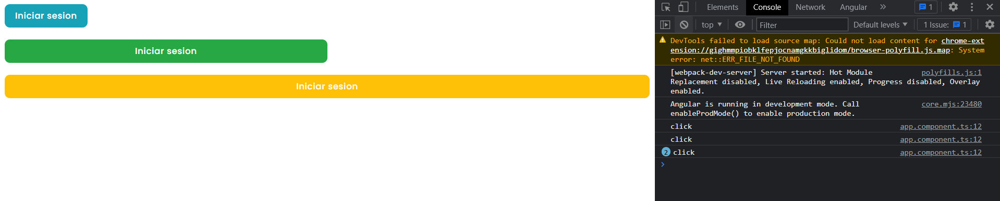

# Angular and Storybook

## Development server for angular

Run `ng serve` for a dev server. Navigate to `http://localhost:4200/`. The application will automatically reload if you change any of the source files.

## Development server for Storybook
Run `npm run storybook` for a dev server. Navigate to `http://localhost:6006/`. The application will automatically reload if you change any of the source files.

## Components in storybook

## Components in Angular

